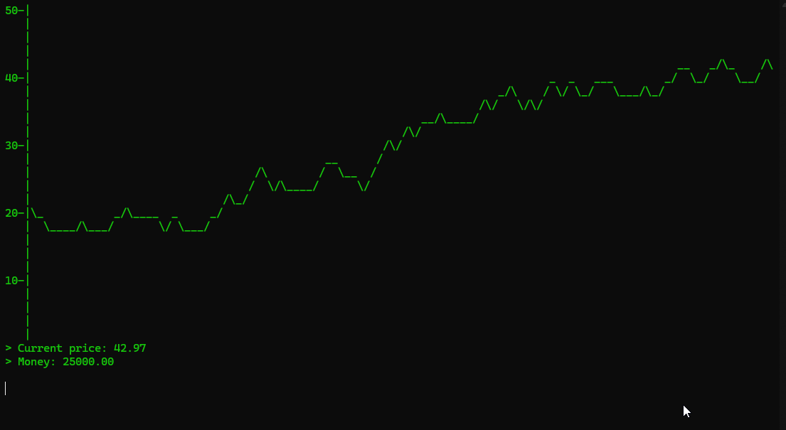

<!-- Improved compatibility of back to top link: See: https://github.com/othneildrew/Best-README-Template/pull/73 -->

<!-- PROJECT SHIELDS -->
<!--
[![Forks][forks-shield]][forks-url]
[![Stargazers][stars-shield]][stars-url]
[![Issues][issues-shield]][issues-url]
[![project_license][license-shield]][license-url]
-->
[![LinkedIn][linkedin-shield]][linkedin-url]

<!-- Project Title -->

<h1 align="center">To The Moon: And Straight Into The Dirt</h1>

  <a href="https://github.com/barter127/ToTheMoonGame">
    

  

    Developed in 9 weeks for programming fundementals module.
     
     
    <a href="https://github.com/barter127/The-Tables-Turn/issues/new?labels=bug&template=bug-report---.md">Report Bug</a>
    &middot;
    <a href="https://github.com/barter127/The-Tables-Turn/issues/new?labels=enhancement&template=feature-request---.md">Request Feature</a>
  

### Built With
  

<!-- GETTING STARTED -->
## About The Project

**Game loop:**
- Every 3 seconds a new day will start and the price of the asset will increase or decrease.
- Price is more likely to increase if it increased before and vice versa.
- Buy high and sell low to make as much money as possible!

**Command List:**
- buy <amount>: Buys amount of doughnuts"
- sell <amount>: Sells amount of doughnuts"
- help: Dude you just used it you know what it does"
- dong: Prints the amount of money you have in Vietnamese Dong"
- share: Prints your share percentage"
- exit: exits game"

**Events:**
- Every day there is a chance for an event to occur.
- They can be positive or negative increase to player stats.
- They can also effect the market health positively or negatively.
- One event gives the player a market prediction. The prediction is programmed to sometimes be incorrect
  

<!-- CONTACT -->
### Contact

Heather Carter - heathercarter2006@outlook.com

LinkedIn: [https://www.linkedin.com/in/heathercarter2006](https://www.linkedin.com/in/heathercarter2006)
     
     

<!-- ACKNOWLEDGMENTS -->
## Acknowledgments

* Sprites: [ansimuz](https://ansimuz.itch.io/streets-of-fight)

<!-- MARKDOWN LINKS & IMAGES -->
<!-- https://www.markdownguide.org/basic-syntax/#reference-style-links -->
[contributors-shield]: https://img.shields.io/github/contributors/github_username/repo_name.svg?style=for-the-badge
[contributors-url]: https://github.com/github_username/repo_name/graphs/contributors
[forks-shield]: https://img.shields.io/github/forks/github_username/repo_name.svg?style=for-the-badge
[forks-url]: https://github.com/barter127/The-Tables-Turn/network/members
[stars-shield]: https://img.shields.io/github/stars/github_username/repo_name.svg?style=for-the-badge
[stars-url]: https://github.com/github_username/repo_name/stargazers
[issues-shield]: https://img.shields.io/github/issues/github_username/repo_name.svg?style=for-the-badge
[issues-url]: https://github.com/github_username/repo_name/issues
[license-shield]: https://img.shields.io/github/license/github_username/repo_name.svg?style=for-the-badge
[license-url]: https://github.com/github_username/repo_name/blob/master/LICENSE.txt
[linkedin-shield]: https://img.shields.io/badge/-LinkedIn-black.svg?style=for-the-badge&logo=linkedin&colorB=555
[linkedin-url]: https://www.linkedin.com/in/heathercarter2006
[product-screenshot]: images/screenshot.png
